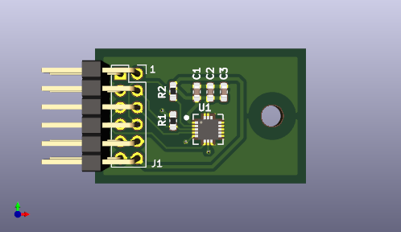

# SharpCoach IMU Breakout
A simple breakout board for the ST LSM6DS33 IMU using a modified Digilent Type 2A PMOD interface. The board breaks out both interrupt pins to facilitate notifying the controlling device of IMU events.

# Pinout
1. SS
2. MOSI
3. MISO
4. SCK
5. GND
6. VCC
7. INT1
8. NC
9. INT2
10. NC
11. GND
12. VCC

# License

